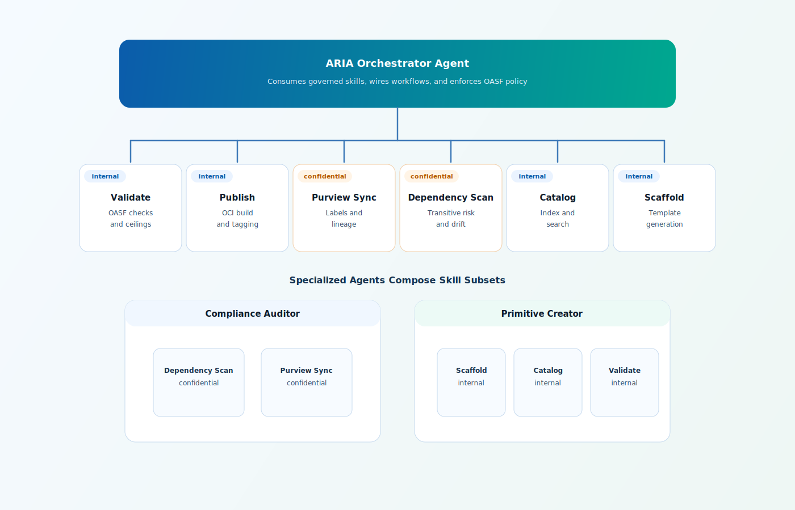
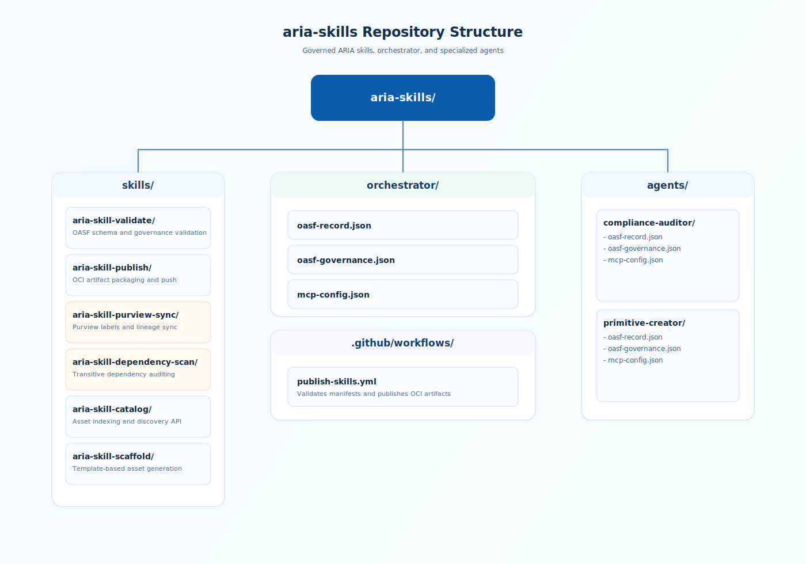

# aria-skills — ARIA's Own Governed Skill Registry

The ARIA framework governs itself. This repository contains the OASF-governed
MCP skills and orchestrator that operate the ARIA platform — and they're
published, discovered, and consumed through ARIA's own marketplace.

**Every skill in this repo has an OASF record, a governance overlay, and is
published as an OCI artifact through the same CI/CD pipeline it helps enforce.**

## Architecture



Brand-aligned architecture view with orchestrator, governed skills, and specialized agents.

## Skills

| Skill | OASF Name | Sensitivity | Tools |
|-------|-----------|-------------|-------|
| **validate** | `aria.dev/skills/validate` | internal | `validate_oasf_record`, `validate_governance_overlay`, `check_sensitivity_ceiling`, `validate_full` |
| **publish** | `aria.dev/skills/publish` | internal | `build_oci_artifact`, `push_to_registry`, `calculate_cid`, `tag_release` |
| **purview-sync** | `aria.dev/skills/purview-sync` | confidential | `apply_sensitivity_label`, `create_data_map_entity`, `create_lineage_edge`, `evaluate_dlp_policy` |
| **dependency-scan** | `aria.dev/skills/dependency-scan` | confidential | `scan_transitive_deps`, `check_ceiling_violations`, `detect_deprecated_deps`, `generate_compliance_report` |
| **catalog** | `aria.dev/skills/catalog` | internal | `index_asset`, `search_assets`, `get_asset_manifest`, `list_versions`, `filter_by_governance` |
| **scaffold** | `aria.dev/skills/scaffold` | internal | `scaffold_from_template`, `generate_oasf_record`, `suggest_skill_taxonomy`, `propose_governance_overlay` |

## Agents

| Agent | Consumes | Purpose |
|-------|----------|---------|
| **orchestrator** | All 6 skills | Central agent for all ARIA workflows (CI/CD, catalog, scaffolding) |
| **compliance-auditor** | dependency-scan, purview-sync | Automated compliance assessment and audit reporting |
| **primitive-creator** | scaffold, catalog, validate | Helps developers create new ARIA assets with proper classification |

## Quick Start

### Run a skill locally

```bash
cd skills/aria-skill-validate
npm install
node server.mjs
# Skill is now running as an MCP server on stdio
```

### Wire skills into Claude Desktop

Copy the MCP config from any agent to use its skills:

```bash
# Use the orchestrator's config (all 6 skills)
cp orchestrator/mcp-config.json ~/.config/claude/mcp-config.json

# Or just the compliance auditor's skills
cp agents/compliance-auditor/mcp-config.json ~/.config/claude/mcp-config.json
```

### Install a skill via apm

```bash
# From the aria-skills OCI registry
apm install ghcr.io/joshgarverick/aria-skills/validate:1.0.0 --target claude-desktop
apm install ghcr.io/joshgarverick/aria-skills/dependency-scan:1.0.0 --target vscode
```

### Build a specialized agent

Create a new agent that consumes specific skills:

```bash
# Use the scaffold skill to generate a new agent
node skills/aria-skill-scaffold/server.mjs
# Then call: scaffold_from_template with asset_type="agent"

# Or manually: create a directory with oasf-record.json referencing
# the skills you want, plus an mcp-config.json wiring them together
```

## Self-Hosting: ARIA Governs Itself

This is the key architectural proof point. Every artifact in this repo is
governed by the same framework it helps operate:

1. Each skill has an `oasf-record.json` declaring its capabilities via
   the OASF skill taxonomy
2. Each skill has an `oasf-governance.json` declaring its sensitivity tier,
   approval chain, and compliance frameworks
3. The GitHub Actions workflow validates these manifests on every PR using
   the same checks the `aria-skill-validate` tool performs
4. On merge, skills are published as OCI artifacts to GHCR
5. Specialized agents consume these artifacts from the registry and compose
   them into workflows — through the same `apm install` pattern that
   enterprise teams use for their own AI assets

The compliance auditor agent that audits other agents' governance is itself
ARIA-governed. The validation skill that checks OASF records has its own
OASF record that gets checked. It's turtles all the way down.

## Repository Structure



Brand-aligned repository map showing skills, orchestrator, specialized agents, and CI workflow.
